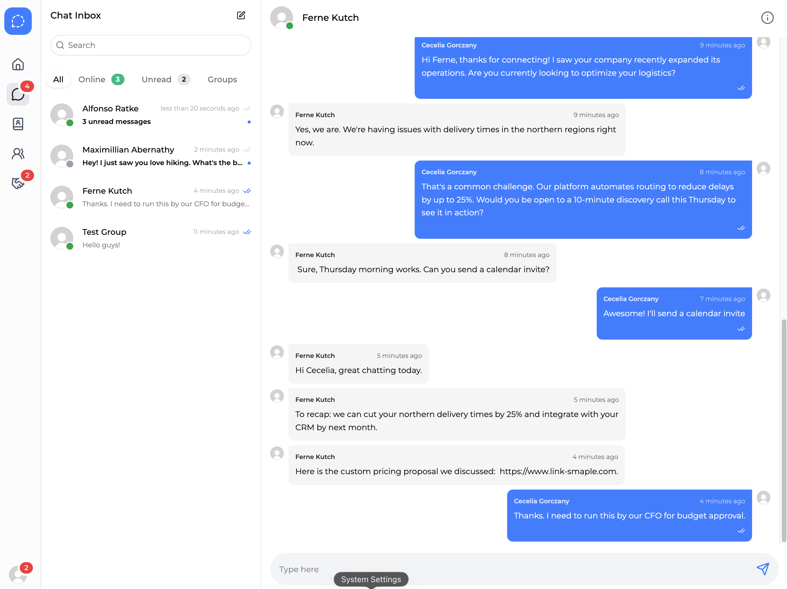
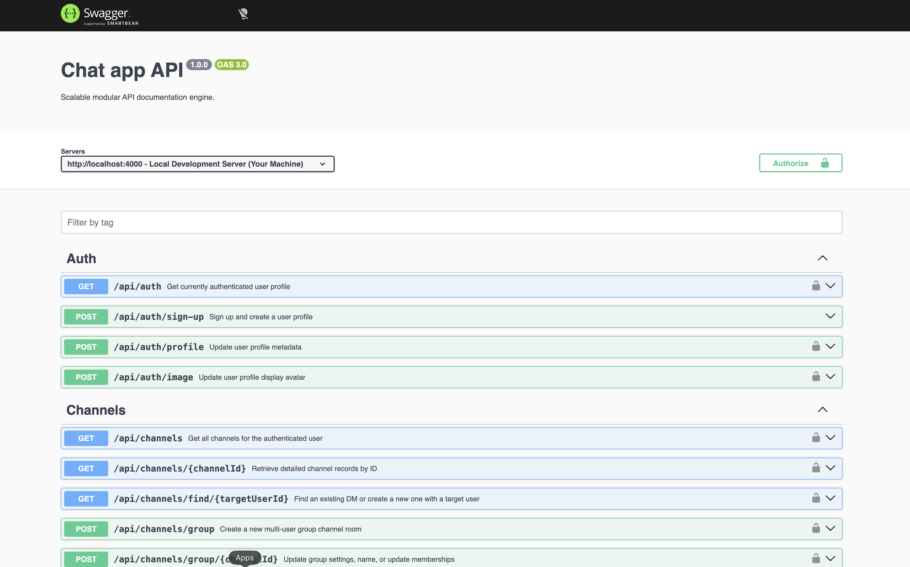
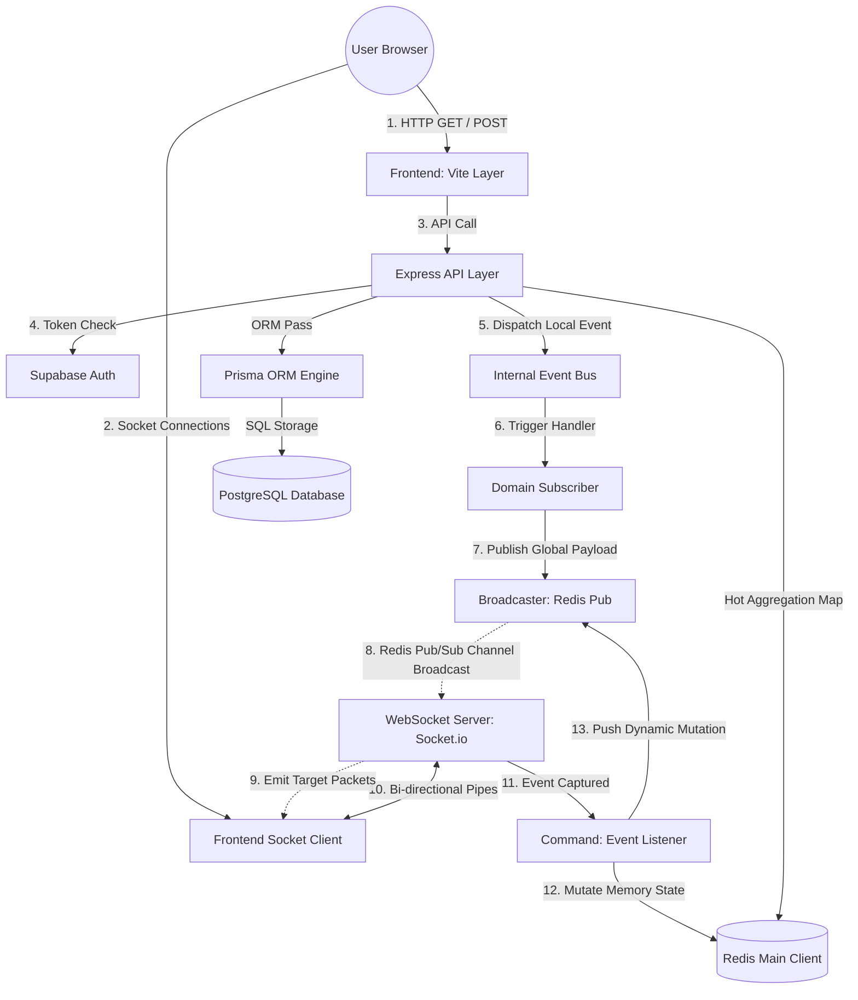

# Chat App - Full Stack

A high-performance, enterprise-grade real-time chat engine merging Slack's channel workspaces with Discord's active online presence topologies. Built on a self-healing hybrid caching model using React, Node.js, Express, TypeScript, InversifyJS, PostgreSQL, and Redis.





## 🛠 Tech Stack

- **Frontend:** React, Typescript, Vite, Tailwind CSS, TanStack Query (v5)
- **Backend:** Node.js, Express.js, Typescript, Prisma ORM, InversifyJS (IoC Dependency Injection)
- **Database:** PostgreSQL (Local Docker) & Supabase PostgreSQL (Production) via Prisma ORM
- **In-Memory Cache:** Redis (Sliding Window Presence Leases & Atomic Mutation Hashes)
- **Real-Time Layer:** Socket.io (Binary MessagePack Transport Pipeline)
- **Authentication & Storage:** Supabase (Auth & S3 Buckets)
- **State/API:** TanStack Query (v5), Supabase (Auth)
- **Infrastructure:** Docker & Docker Compose
- **Architecture:** Feature-Sliced Design (FSD Frontend) & Modular Three-Tier Domain Layers (Backend)

## 🌟 Project Features

- [x] **Secure Authentication**: Handled by Supabase Auth (JWT-based), verified securely at backend middleware checkpoints.
- [x] **Sliding Window Presence Leases:** Real-time user statuses managed via continuous WebSocket heartbeats.
- [x] **Self-Healing Redis Mappings:** Automatic caching layers that sync with PostgreSQL on cache misses.
- [x] **Direct Message Fan-Out:** Direct messaging for active viewports combined with low-overhead ambient private signaling streams.
- [x] **Optimistic UI Hydration:** Instant timeline rendering via TanStack Query cache patching hooks.
- [x] **Relational Data**: Complex user relationships (Connections, Channels, Messages) via Prisma & PostgreSQL.
- [x] **Dockerized Workflow**: One-command setup for DB, Backend, Frontend, pgAdmin, redis-insight.
- [x] **Cloud Storage**: Profile pictures and posts stored in Supabase S3 buckets.
- [x] **Responsive UI**: Tailwind CSS and ShadcnUI.

## 🏗 System Architecture

The project splits concerns between **Identity** (Supabase) and **Application Data** (Postgres).



## 🏗 Architecture & Performance

## 📁 Backend Layered IoC Design

The backend relies on strict Dependency Injection patterns powered by InversifyJS to isolate database layers from volatile memory runtimes:

- **Routers:** Expose declarative endpoints, protected by authorization middlewares.
- **Controllers:** Handle HTTP parameter extraction and orchestrate service boundaries.
- **Services (PresenceService, BroadcastService):** Agnostic pure business engines dealing with memory arrays and cache primitives.
- **Repositories:** Abstract lower-tier database interactions using Prisma.

## 📁 Frontend Feature-Sliced Design (FSD)

- **App:** Centralized data synchronization layout engines.
- **Pages:** Composed of multiple widgets. This is the primary entry point for **Route-Level Lazy Loading**.
- **Widgets:** Complex, self-contained blocks.
- **Features:** Live action interfaces (e.g., online-presence, sending real-time chat messages).
- **Entities:** Pure interface domains and normalized mutation contexts (e.g., message, notification).
- **Shared:** Reusable UI components (Modal, Inputs) and utility functions.

## 🔐 Deep Dive: Core System Engineering

### 1. Sliding Window Presence & Atomic Pruning Worker

Instead of recording user availability directly in relational rows, the server utilizes a Sliding Window Lease Pattern:

- Every active layout executes a heartbeat event every 30 seconds, writing an expiring string payload to Redis with an explicit Time-to-Live (EX 60).

- Simultaneously, it appends the user ID to a Redis Sorted Set (presence:global), setting the score as the current Unix timestamp (Date.now()).

- **The Pruning Worker:** An isolated background service ships an atomic Lua script to Redis every 30 seconds. This evaluates and removes dead user profiles using ZRANGEBYSCORE in a single database round-trip without blocking the main event loop thread.

### 2. Decentralized User Fan-Out Pipeline

To optimize network distribution and avoid the memory leak traps of forcing sockets to subscribe and unsubscribe from dynamic room layers on the fly, the system processes messaging events via an Atomic Direct Target Fan-Out Architecture:

- **The Unified Multiplex Stream:** When a text frame hits the backend `SendMessageCommand`, the socket layer extracts the target conversation channel's membership array from the hot Redis Set (`presence:channel_members:${channelId}`).

- **Targeted Cluster Dispatches:** Instead of blasting payloads into an open room partition, the `BroadcasterService` loops through the explicit user identifiers and routes the data payload directly to each individual member's isolated private pipeline (`emitToUser`).

- **Client-Side Viewport Discrimination:** When the payload drops into the frontend layout's unified orchestrator, the application handles state updates conditionally:
  1. **Active Context Viewport:** If the incoming `payload.channelPayload.channelId` matches the `channelId` parameter currently opened in the user's viewport page, the message is seamlessly appended to the chat timeline cache list.

  2. **Ambient Background Context:** If the payload belongs to an unseen room, the orchestrator triggers an immediate state mutation on the dashboard cache key—incrementing the targeted channel sidebar unread number and refreshing previews without text distribution leaks.

## 🚀 Quick Start Guide

### 1. Environment Configuration

Create matching environment files inside your platform repository bounds:

- ### Backend folder root `.env`

```
NODE_ENV=development
PORT=4000

# Database
DATABASE_URL=postgresql://root:root@db:5432/chat_app_db

# Redis
REDIS_URL=redis://redis:6379

# Supabase Auth (Backend)
SUPABASE_URL="https://your-project.supabase.co"
SUPABASE_SERVICE_ROLE_KEY="your-service-role-key"

# Frontend Domain URL
APP_URL=http://localhost:5173
```

- ### Frontend folder root `.env`

```
# Backend Domain URL
VITE_API_URL="http://localhost:4000"

# Supabase Auth (Frontend)
VITE_SUPABASE_URL="https://your-project.supabase.co"
VITE_SUPABASE_PUBLISHABLE_KEY="your-public-key"
```

### 2. Core Server Initialization Sequence

Install parameters, map data configurations, and spin up the backend execution engine:

```
# 1. Install operational dependencies
npm install

# 2. Run Prisma development structural syncs
npx prisma db push

# 3. Boot up the development engine
npm run dev
```

## 🔗 Connection Details

| Service          | URL                              | Credentials                         |
| ---------------- | -------------------------------- | ----------------------------------- |
| Frontend         | `http://localhost:5173`          | —                                   |
| Backend API      | `http://localhost:4000/api`      | —                                   |
| Backend API Docs | `http://localhost:4000/api-docs` | —                                   |
| pgAdmin 4        | `http://localhost:5050`          | root@root.com / root                |
| redis-insight    | `http://localhost:5540`          | redis://redis:6379 (connection url) |

## 📁 Project Structure

```
├── .github/
│ └── workflows/
│ ├── deploy-frontend.yml # Global Action for Frontend
│ └── deploy-backend.yml # Global Action for Backend
├── instagram-backend/ # Node.js + Express.js + Prisma
├── instagram-frontend/ # React + Vite + TanStack Query
├── docker-compose.yml # Infrastructure orchestration
```

```
├── src/
│ ├── config/ # IoC Container Configuration Types
│ ├── middlewares/ # Supabase Authentication Token Interceptors
│ ├── modules/
│ │ ├── presence/ # Presence Controllers, Routers, and Services
│ │ ├── channel/ # Channel Repository Boundaries
│ │ └── connection/ # Connection Request Infrastructure
│ ├── lib/ # Redis and Prisma Client Singletons
| ├── services/ # Global Services Redis Main Client and Broadcaster Redis Pub
| ├── subscribers/ # Subscriber handlers
| ├── web-socket/web-socket.server.ts # Web Socket (Socket.io) Initializer
| | ├── commands # Web Socket event handlers
│ └── app.ts # Primary Server Lifecycle Initializer
```

## 📄 License

This project is for educational purposes.
